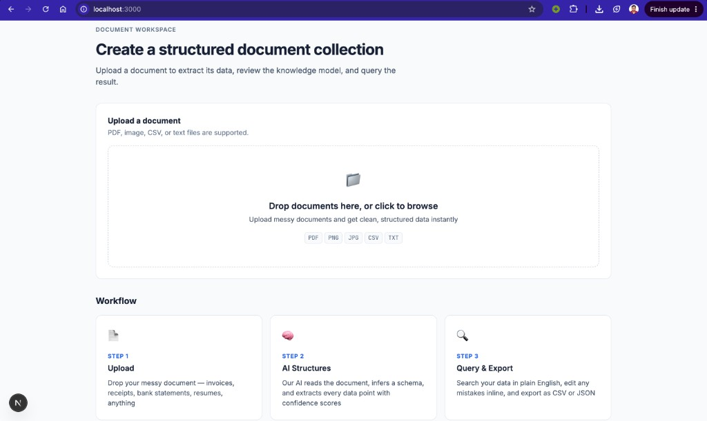

# DocStruct

**Turn messy documents into structured, queryable data.**

Upload any document — PDF, image, CSV, or text — and get clean, structured data you can search, query in plain English, and export. Powered by AI schema inference.




---

## What It Does

1. **Upload** — Drop a messy document (invoice PDF, receipt photo, CSV export, text file)
2. **AI Structures** — The backend parses the document, infers a schema (column names + types), and extracts every data point with a source citation and a verified confidence score
3. **Review & Edit** — See the extracted data in a clean table showing the page and the quoted source text behind each value; low-confidence fields are flagged for review and any cell can be corrected inline
4. **Query** — Ask a question and get a grounded answer: a deterministic headline, supporting rows with the same confidence/citations as extraction, and honest coverage when some values are low-confidence. Refine with column filters when you don't need English. Greetings and off-topic NL input are refused with a reason instead of inventing a table dump
5. **Export** — Download as CSV or JSON

- **Document-aware layout** — the same extraction that reads the data also names the document ("Income Tax Return", *Financial*) and groups its fields into the sections that document is organised around, so the Knowledge view fits a tax return, a lab report or a résumé without a template for any of them
- **Schema evolution** — new documents with unseen fields grow the collection schema automatically; concurrent uploads use optimistic locking so columns are not silently lost
- **Grounded answers** — query results keep per-cell provenance; the headline is computed from the full result set; the LLM may only phrase those facts (never invent numbers)
- **Structured filters (no LLM)** — column whitelist + operator enum + bind parameters; nested filters return matching entries by default (toggle for documents)
- **NL → SQL with guardrails** — for phrasing filters can't express; intent gate first, then SELECT-only AST whitelist scoped to the collection's tables. Broad real questions ("show me everything") still run — breadth is not a refusal signal
- **Image OCR via LLM vision** — no local OCR pipeline needed
- **Verified confidence and a citation on every extracted cell** — see [Reliability & Hallucination Mitigation](#reliability--hallucination-mitigation)

---

## Reliability & Hallucination Mitigation

A document extraction system that is confidently wrong is worse than one that admits it does not know. DocStruct is built so that every value it reports can be traced back to a specific place in the document, and so that anything it could not verify is visibly marked rather than quietly presented as fact.

### Retrieval-grounded extraction

Parsers do not hand the LLM an anonymous wall of text. Each document is split into deterministic, numbered, page-tagged chunks (`Chunker`), and the prompt presents them as addressable blocks:

```
[chunk 17 | page 3]
Invoice Number: INV-2041
Total Due: $1,234.50
```

The prompt's grounding contract states — first, and as overriding every other instruction — that these blocks are the only permitted source of information, that inference, estimation and calculation are forbidden, and that a missing field must come back as `null`. Every non-null value must cite the chunk it was read from and include `raw_source`: a verbatim substring of that chunk.

To be precise about what this is: the whole document is still sent to the model. There is no vector store and no similarity retrieval, because for single-document extraction retrieving a *subset* would cause misses rather than prevent them. What the chunking buys is **addressability** — the ability to verify, after the fact, that a value came from where the model says it came from.

### Source attribution

Every extracted cell carries its evidence, so the API response, the stored row and the UI all answer "where did this come from?":

```json
{
  "invoice_number": {
    "value": "INV-2041",
    "confidence": "high",
    "rawSource": "Invoice Number: INV-2041",
    "evidence": { "page": 3, "chunk": 17, "score": 1.0 }
  }
}
```

The page number is never taken from the model — it is resolved from the cited chunk, and a disagreeing page is corrected. Attribution is persisted twice: hierarchically on the document (`documents.raw_json`) and per cell on the collection's data table (`_evidence_json`), so exported and queried rows stay auditable.

The two audiences for that evidence get two different views of it. **Knowledge** answers "what was extracted, and can I trust it?" — every field shows its confidence, the page it was read from, and the quoted source text, in those terms only. **Developer Data** answers "how did the pipeline produce this?" — chunk indexes, raw verification notes and the numeric score, per field, next to the raw extraction JSON. Chunk numbers are an implementation detail of verification, so they never appear in the reader's view.

How the Knowledge view is laid out is decided by the extraction, not by the client. The same response that carries the schema and the rows also carries `documentType` (`{ name, category }`) and `knowledgeSections` — a title, a description and the schema columns each section covers — inferred from the document's own semantics in the call that was already being made. A tax return comes back as Taxpayer Information / Filing Details / Tax Summary, an invoice as Vendor / Customer / Line Items / Payment Summary, a résumé as Experience / Education / Skills. Section field names are resolved against the real schema columns before they leave the backend, so the client renders what it is given; a document with no meaningful grouping returns its type and an empty list, and says so.

### Confidence scoring

Confidence is computed by the backend (`ConfidenceScorer`), not reported by the LLM. Self-reported confidence is used only as a penalty — a model admitting doubt is informative, a model claiming certainty is not, since the same model that invents a value also grades it.

Scoring starts at 1.0 and applies fixed deductions:

| Finding | Deduction |
|---|---|
| No chunk cited for a non-null value | −0.30 |
| Cited chunk does not exist | −0.50 |
| Quoted source text appears nowhere in the document | −0.35 |
| Quote is real but in a different chunk than cited | −0.25 |
| No verbatim quote supplied | −0.15 |
| Value not present in the text it cites | −0.20 |
| Value failed format validation | −0.30 |
| Model self-reported "medium" / "low" | −0.10 / −0.30 |

The result maps to **High** (≥ 0.80), **Medium** (≥ 0.50) or **Low**. Two findings force Low regardless of the arithmetic: a value that appears **nowhere** in the document text, and a value that fails format validation. Matching is normalization-aware, so `$1,234.50` matches `1234.5`, lakh/crore grouping like `31,48,250` matches `3148250`, and ISO date conversion (`March 14, 2026` → `2026-03-14`) is never treated as a fabrication.

Text matching is deliberately tiered, because a strict substring test flags correct extractions on any multi-column page. PDF text extraction linearizes columns row by row, so a phrase read correctly out of one column arrives with the neighbouring column's words spliced into it — a two-column résumé yields `Software Engineer B.Tech in Computer / Enphase Energy Science`, in which `B.Tech in Computer Science` is never contiguous:

| Value length | What counts as present |
|---|---|
| One word | The word appears in the text |
| Two to five words | Contiguous, or all words within a span of twice the phrase length |
| Six or more words | Every word appears in the text, with no proximity requirement |

The long-value tier exists because such values are assemblies rather than quotes — a skills grid read as one list has no contiguous source anywhere in the document. Coverage still catches invented content, since a skill the document never mentions leaves a word that appears nowhere, but it cannot detect reordering inside the value.

Every score is deterministic — the same extraction always produces the same score. There is no ML confidence model, no logprobs and no second LLM pass.

### Validation

Extracted values are format-checked (`FieldValidator`) and a failure downgrades the field to Low with an explanation. It is never dropped, never auto-corrected, and never silently accepted:

- **Dates** — strict ISO calendar validation, so `2026-02-31` is rejected rather than shifted
- **Emails and URLs** — structural validation, including for columns typed as plain text but named like an email field
- **Phone numbers** — digit-count and character-set checks that tolerate international punctuation
- **IDs and reference numbers** — must look like short identifiers, not prose
- **Numbers and currency** — must have survived numeric coercion
- **Invoice totals** — line items are summed (plus tax/shipping, minus discounts) and compared against the stated total; a mismatch beyond a 1% tolerance downgrades the total, because we cannot know which of the two numbers is wrong

### Why the system refuses to guess

A plausible invented value costs more than a blank field: it looks correct, so nobody checks it, and it flows into every downstream query and export. A `null` is honest, visible and fixable.

So the prompt treats an omission as a correct answer and a guess as a failure; the UI renders absent values as **"Not found in document"** rather than a dash; low-confidence cells are highlighted and say in plain language why they need review; and each upload reports how many values could not be fully verified, so review starts with a number instead of a hunt.

The same rule applies one level up, to the question itself. A greeting or off-topic prompt used to produce a confident-looking `SELECT *` over the collection — SQL that was perfectly safe and completely irrelevant. The NL→SQL path now returns `answerable: false` with a short reason, and never reaches SQL validation or the database. A refusal is a successful response, not an error: nothing went wrong, the input was not a question about the data.

### Known limitations

- **Images cannot be verified.** An image has no text layer to check a citation against, so grounding checks are skipped rather than faked and no value from an image can be rated High. Every such cell says so in its evidence note.
- **Verification proves presence, not meaning.** The scorer can prove a value exists in the cited text; it cannot prove the model picked the *right* value. A total that was correctly copied from the wrong line still scores High — the cross-field total check exists to catch exactly that case for invoices.
- **Column layout is the main source of false alarms.** Grounding is checked against extracted text, not the visual page, and multi-column extraction scrambles reading order. The tiered matching above absorbs the common cases; making the parser layout-aware would remove the cause rather than compensate for it.
- **Strict grounding can suppress derivable values.** A total that a human would compute from line items comes back `null` if the document never states it. That is the intended trade-off.
- **Per-cell citations cost output tokens**, which lowers the practical ceiling on how many rows one call can return.
- **Query intent is the model's call.** A badly worded real question can be refused; the reason is shown and a clearer retype usually works. Filtering on SQL shape instead would break legitimate broad questions like "show me everything."

---

## Engineering Highlights

- **Grounded, auditable extraction** — documents go to the LLM as numbered, page-tagged chunks; every value cites its chunk, and the backend verifies that citation before deciding how much to trust the value
- **Hybrid persistence** — Spring Data JPA for fixed-shape metadata, `JdbcTemplate` for data tables whose columns are inferred by the LLM at upload time
- **Dynamic DDL done safely** — tables and columns created at runtime with sanitized, quoted identifiers; nested entities get child tables linked by `_parent_row_id`
- **Concurrent schema evolution** — optimistic locking with merge-replay so two uploads cannot drop each other's new columns
- **Grounded querying** — provenance projected onto supporting cells; deterministic headline + coverage; LLM phrasing cannot invent numbers
- **Structured filters without an LLM** — schema-whitelisted columns, operator enum, JDBC bind parameters; injection-shaped values never enter the SQL string
- **Defense-in-depth on NL2SQL** — intent gate first (`answerable`), then SELECT-only + AST table whitelist; a refusal never reaches validation or execution
- **Extraction cache + rate limits** — content-hash cache skips repeat LLM calls; per-client token bucket on model-backed endpoints returns `429` with `Retry-After`
- **Typed exception hierarchy** mapped to one consistent error contract via `@RestControllerAdvice`; internals never leak in 500 responses
- **Real-database testing** — `DynamicTableRepository` and optimistic-lock races are covered by Testcontainers against actual PostgreSQL, not mocks
- **Documented trade-offs** — see [decisions.md](decisions.md) for the reasoning behind every major design choice

---

## Architecture

```
frontend/  Next.js + React + TypeScript  (UI only — no server logic)
    │   REST over HTTP (/api/*, proxied in dev)
    ▼
backend/   Java 21 + Spring Boot 3 + Maven
    ├── controller/   REST endpoints (thin, no business logic)
    ├── service/      Ingestion, extraction, query, export workflows (+ content-hash cache)
    ├── llm/          Provider-agnostic LLM client, prompts, response mapping
    ├── parser/       PDFBox, Commons CSV, text, image pass-through + page-tagged chunking
    ├── repository/   Spring Data JPA (metadata) + JdbcTemplate (dynamic tables)
    ├── ratelimit/    Per-client token bucket on model-backed endpoints
    ├── domain/       Entities, schema model, extraction model
    ├── dto/          Request/response records with Bean Validation
    ├── util/         Citation verification, confidence scoring, field validation
    └── exception/    Typed exception hierarchy + @RestControllerAdvice
    │
    ▼
PostgreSQL   collections + documents metadata (JPA/jsonb)
             one dynamically-created data table per collection
             (+ child tables for nested entities, managed via JdbcTemplate)
```

**Why the hybrid persistence?** Collection and document metadata have a fixed shape — a natural fit for JPA. The extracted data tables cannot be modeled as entities because their columns are inferred by the LLM at upload time, so they are created and queried dynamically through `JdbcTemplate` with sanitized, quoted identifiers. Full rationale in [decisions.md](decisions.md).

### REST API

| Method | Path | Purpose |
|--------|------|---------|
| `POST` | `/api/collections` | Upload first document, create collection (multipart) |
| `POST` | `/api/collections/{id}/documents` | Add document to a collection (multipart) |
| `GET` | `/api/collections` | List collections |
| `GET` | `/api/collections/{id}?page=&limit=` | Collection detail + paginated data |
| `DELETE` | `/api/collections/{id}` | Delete collection and its data tables |
| `PATCH` | `/api/collections/{id}/rows/{rowId}` | Edit one data cell |
| `POST` | `/api/collections/{id}/filter` | Structured filter/sort (`{"filters":[{"column","operator","value","entity?"}], "match":"all"|"any", "resultUnit":"entries"|"documents", "sort":{...}}`) — nested filters default to matching child entries; `documents` keeps EXISTS on parents; no LLM |
| `GET` | `/api/collections/{id}/columns/{column}/values?entity=` | Distinct values (`SELECT DISTINCT`) on main or nested entity table — categorical dropdowns, no LLM |
| `POST` | `/api/collections/{id}/query` | Natural-language query (`{"query": "..."}`). Non-questions return `success: true` with `answerable: false` and a `reason` |
| `GET` | `/api/collections/{id}/export?format=csv\|json` | Download data |
| `GET` | `/api/health` | Liveness + DB/LLM dependency status |

Errors always share one contract: `{ "success": false, "error": "...", "code": "...", "details": "..." }` with a meaningful HTTP status. Rate-limited requests return `429` with a `Retry-After` header.

---

## Quick Start

### Prerequisites

- **Java 21** and **Maven 3.9+**
- **Node.js 18+** and **npm 9+**
- **PostgreSQL 15+** (or Docker, see below)
- **LLM API key** — free options: [Google AI Studio](https://aistudio.google.com/apikey) or [OpenRouter](https://openrouter.ai/keys)

### 1. Database

Either run Postgres via the included compose file:

```bash
docker compose up -d
```

Or use a local install and create the database once:

```bash
createuser -s docstruct
psql -d postgres -c "ALTER USER docstruct WITH PASSWORD 'docstruct';"
createdb -O docstruct docstruct
```

The backend connects to `jdbc:postgresql://localhost:5432/docstruct` with user/password `docstruct`/`docstruct` by default (override with `DB_URL`, `DB_USERNAME`, `DB_PASSWORD`).

### 2. Backend

```bash
cp .env.example .env.local        # add your LLM API key
cd backend
set -a; source ../.env.local; set +a
mvn spring-boot:run
```

The API is now on [http://localhost:8080](http://localhost:8080) — check [http://localhost:8080/api/health](http://localhost:8080/api/health).

### 3. Frontend

```bash
cd frontend
npm install
npm run dev
```

Open [http://localhost:3000](http://localhost:3000) and try it with the sample document in [`samples/`](samples/). The dev server proxies all `/api/*` calls to the backend (set `API_URL` to point elsewhere).

### Tests

```bash
cd backend && mvn test
```

Unit tests run everywhere — including the NL2SQL whitelist, query-intent refusals, extraction cache, and rate limiter. The `DynamicTableRepository` and optimistic-lock integration tests spin up real PostgreSQL via Testcontainers and are skipped automatically on machines without Docker.

---

## Environment Variables

Any OpenAI-compatible chat-completions provider works. The recommended free option is [Google AI Studio](https://aistudio.google.com/apikey) (~1,500 free requests/day for `gemini-2.5-flash`, no credit card needed).

| Variable | Required | Default | Description |
|----------|----------|---------|-------------|
| `LLM_API_KEY` | Yes* | — | LLM provider API key (falls back to `OPENROUTER_API_KEY`) |
| `LLM_BASE_URL` | No | `https://openrouter.ai/api/v1` | Provider base URL. For Google AI Studio use `https://generativelanguage.googleapis.com/v1beta/openai` |
| `LLM_MODEL` | No | `google/gemini-2.5-flash` | Model name. For Google AI Studio use `gemini-2.5-flash` |
| `OPENROUTER_API_KEY` | Yes* | — | Alternative to `LLM_API_KEY` when using OpenRouter |
| `LLM_MAX_TOKENS` | No | `8192` | Cap on `max_tokens` per LLM request. Use `4096` on Groq free tier (12k TPM counts input + reserved output). Also lower if OpenRouter rejects with a 402 "requires more credits" error |
| `EXTRACTION_CACHE_ENABLED` | No | `true` | Cache extraction results by file content hash (and schema, for follow-up docs) |
| `RATE_LIMIT_ENABLED` | No | `true` | Per-client token bucket on upload and query endpoints |
| `RATE_LIMIT_CAPACITY` | No | `20` | Requests allowed per window |
| `RATE_LIMIT_WINDOW` | No | `1m` | Refill window for the rate limiter |
| `CORS_ALLOWED_ORIGINS` | No | `http://localhost:3000` | Comma-separated origins allowed to call the API directly (set to the frontend URL in production) |
| `DB_URL` | No | `jdbc:postgresql://localhost:5432/docstruct` | JDBC URL |
| `DB_USERNAME` | No | `docstruct` | Database user |
| `DB_PASSWORD` | No | `docstruct` | Database password |
| `API_URL` | No | `http://localhost:8080` | Backend URL used by the frontend `/api` proxy (dev + Docker/Railway **build**) |
| `PORT` | No | `8080` | Backend listen port (Railway injects this) |

---

## Deploy on Railway

Public demo: one Railway project with **Postgres**, **backend**, and **frontend**. The frontend is the user-facing URL; it proxies `/api/*` to the backend.

### 1. Push and create the project

1. Push this repo to GitHub.
2. At [railway.app](https://railway.app) → **New Project** → **Deploy from GitHub repo**.
3. Add a **PostgreSQL** plugin to the project.

### 2. Backend service

- **Root directory:** `backend`
- **Builder:** Dockerfile ([backend/Dockerfile](backend/Dockerfile))
- **Generate a public domain** (e.g. `https://docstruct-api.up.railway.app`)
- **Variables:**

```text
DB_URL=jdbc:postgresql://${{Postgres.PGHOST}}:${{Postgres.PGPORT}}/${{Postgres.PGDATABASE}}
DB_USERNAME=${{Postgres.PGUSER}}
DB_PASSWORD=${{Postgres.PGPASSWORD}}
LLM_API_KEY=<your key>
LLM_BASE_URL=https://generativelanguage.googleapis.com/v1beta/openai
LLM_MODEL=gemini-2.5-flash
CORS_ALLOWED_ORIGINS=https://<frontend-public-domain>
```

`Postgres.*` names must match your Postgres service name in Railway (rename the references if your plugin is not called `Postgres`).

### 3. Frontend service

- **Root directory:** `frontend`
- **Builder:** Dockerfile ([frontend/Dockerfile](frontend/Dockerfile))
- **Generate a public domain** — this is the site URL
- **Variables** (available at **build and runtime**):

```text
API_URL=https://<backend-public-domain>
```

No trailing slash. Rebuild the frontend after changing `API_URL` so Next.js rewrites pick it up.

### 4. Smoke test

1. `GET https://<backend>/api/health` — should report DB + LLM status
2. Open the frontend URL → upload a file from [`samples/`](samples/) → filter or **Ask in plain English** → export

Cold starts on the free/trial tier can take a minute on the first request.

---

## License

MIT
